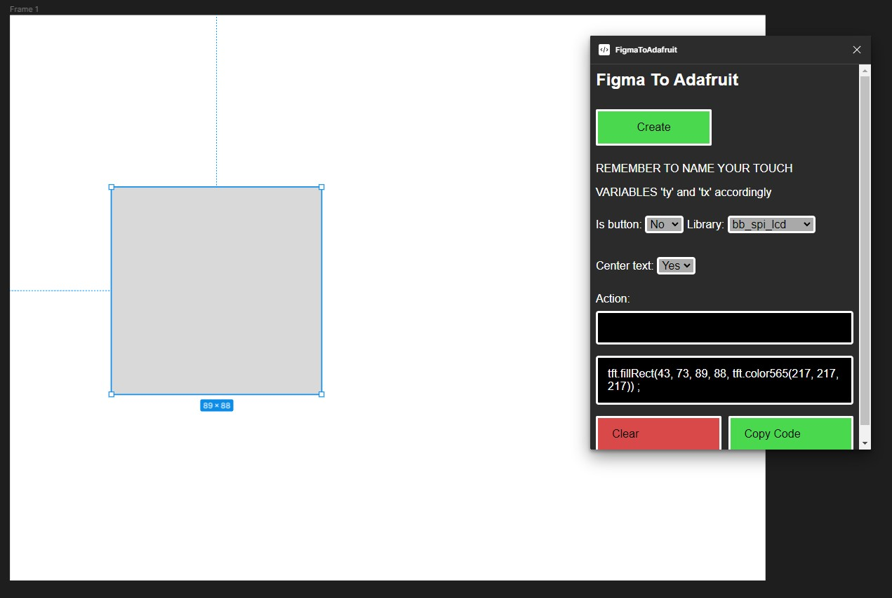

# A Figma plugin to turn objects into Adafruit GFX compatible code!

## Before you make a ton of issues check this out:
[How to install](installation.md)

## List of features:
### -Turn objects into code obviously.
### - Supports multiple libraries!
### - Turn the object into a touchable button!
### - It automatically adds the color using tft.color565().
### - Automatically spit out the corner radius into the line!
### - ~~Planned theme support (who even uses light theme ?)~~ ONLY DARK THEME BECAUSE I SAY SO (LIGHT IS OVERRATED)

# Library support:
| Library  | Support |
| ------------- | ------------- |
| TFT_eSPI  | Mostly-supported ✅  |
| AdafruitGFX | 90% Supported ✅  |
| bb_spi_lcd | Semi-supported  |
| LVGL | No plans for support❌  |
| Other libraries | Not supported❌  |

### [TFT_eSPI](https://github.com/Bodmer/TFT_eSPI):
The library is very similar to AdafruitGFX, that's why i said its Mostly supported.
If there are any problems please HMU on discord or join the [ZynthWare server](https://discord.gg/DPWY2jWeHR).

### [bb_spi_lcd](https://github.com/bitbank2/bb_spi_lcd):
Same as TFT_eSPI, it doesn't support rounded corners yet!

If you would like for me to try and add support to other libraries HMU on discord or join the [ZynthWare server](https://discord.gg/DPWY2jWeHR)!

# Object support:
| Type  | Support |
| ------------- | ------------- |
| Rectangle  | 100% Supported ✅  |
| Line | Planned support⌚  |
| Sphere | Semi-supported  |
| Polygon | No plans for support❌  |
| Star   | No plans for support❌  |
| Arrow  | No plans for support❌  |

### But what do you mean Semi-supported spheres?
Well you can make a square then round it out!

### Aren't arrow just lines with... more lines?
Yes, but it would be pretty hard calculating the arrows lines, wouldn't it?
